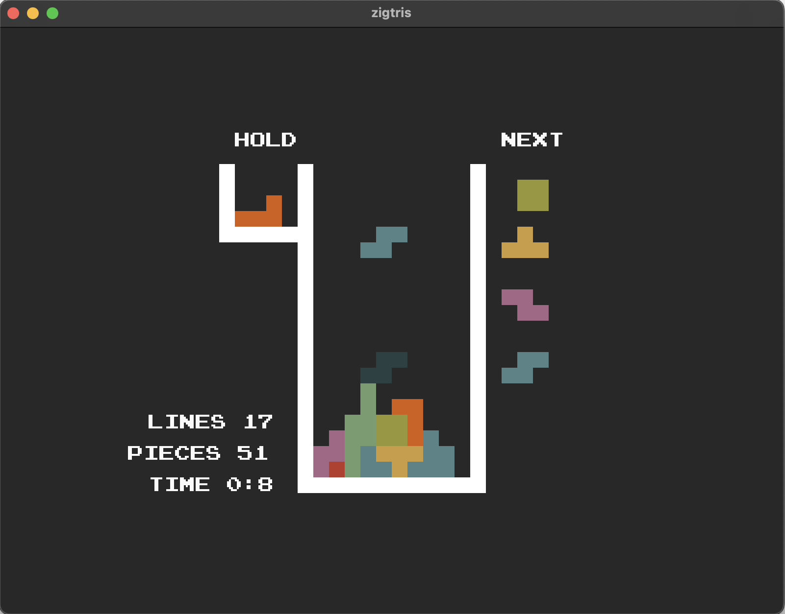

# zigtris
Made with [Zig](https://github.com/ziglang/zig) and [sokol](https://github.com/floooh/sokol-zig)


# Building
```bash
zig build run
```

Requires Zig version 0.14.0 to compile

## Controls
- Arrow keys for movement
- Z: anti-clockwise rotation
- X: clockwise rotation 
- C: hold
- P: pause
